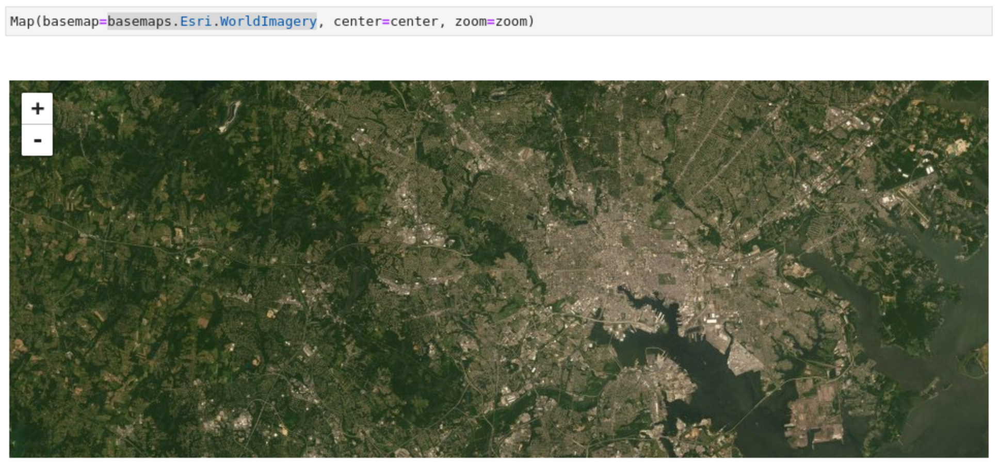
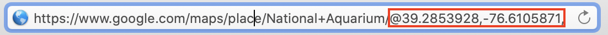
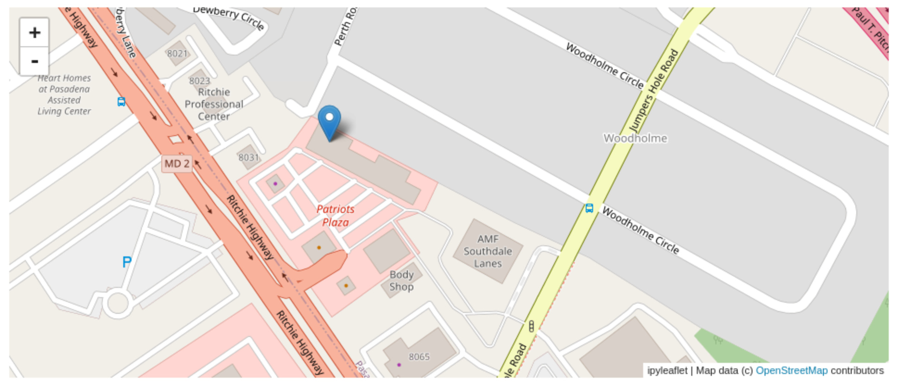
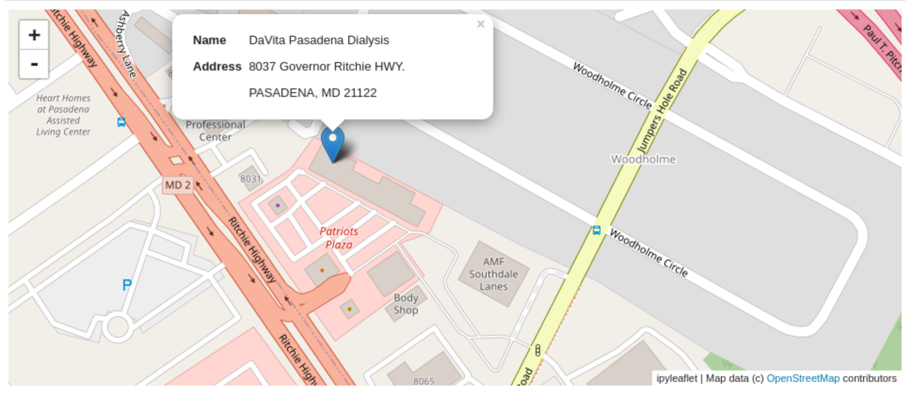

# Lesson 2 - Exploring the Map

### 0. Create a new Jupyter Notebook

Create a new Jupyter notebook for this lesson.

### 1. Exploring the ipyleaflet Documentation

Take a minute to explore the [ipyleaflet documentation](https://ipyleaflet.readthedocs.io/en/latest/index.html).

Questions:

  - How is the documentation organized?
  - What can you do with `ipyleaflet`?
  - What is one feature you want to learn more about?

### 2. Feature - Map

Go to the documentation for the [`Map` class](https://ipyleaflet.readthedocs.io/en/latest/api_reference/map.html).

Questions:

  - How would you add a layer to the map? (Also, what do you think a layer is?)
  - How would you enable zooming in with the scroll wheel on the map?

### 3. Feature - Basemap

Go to the documentation for the [Basemaps](https://ipyleaflet.readthedocs.io/en/latest/api_reference/basemaps.html).

Try changing the basemap of the `Map`! Pick one you want to use for this lesson (one with streetnames would be best).



### 4. Feature - Marker

#### Drawing the Marker

The `Marker` class lets you draw markers on the map. To draw a marker, you'll need the location of the point you want to draw. Try using Google Maps to find the "Baltimore Aquarium".

In the URL, you'll see the longitude and latitude of the point:



Try following the documentation and adding a makrer for the Baltimore Aquarium on our map.

#### Other Marker Capabilities

Scroll down to the `Attributes` section. What other things can you make a `Marker` do?

Try adding a `title` to the marker.

#### Pharmacy Marker

Now look at the pharmacies dataset we found, and try adding a marker for one of the Pharmacies in Maryland!



### 5. Feature - Popup

Now let's add a Popup to the `Marker`, so when you click it, we can see more information about the location.

There are two ways to add a popup to a map:

  1. You can add a popup directly to the map
  2. You can associate a popup with a `Marker`, so when you click on the `Marker`, it'll show or hide the popup.

Follow the documentation, and add a popup to your `Marker`. You'll need to add a new import statement for [`ipywidgets`](https://ipywidgets.readthedocs.io/en/stable/):

```python
from ipywidgets import HTML
```

You can use something like this for the `value` of the popup:

```python
address.value = "<dl>\
<dt>Name</dt>\
<dd>DaVita Pasadena Dialysis</dd>\
<dt>Address</dt>\
<dd>8037 Governor Ritchie HWY. PASADENA, MD 21122</dd>\
</dl>"
```



### 6. Homework - Layer Group

Layer groups let you group together multiple

